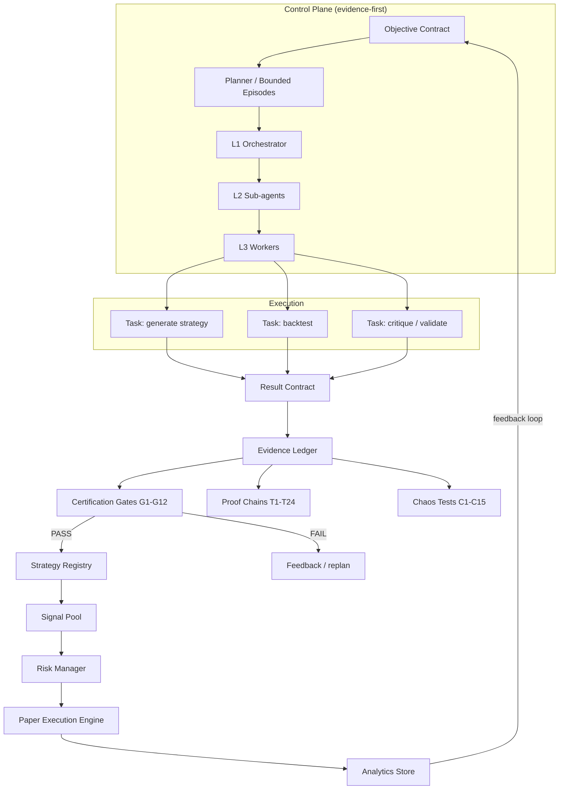
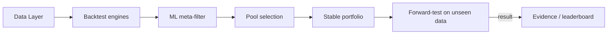

# Kombaine — автономная платформа AI-исследований с мультиагентной оркестрацией

> **Elevator pitch.** Kombaine — это self-contained платформа, на которой **AI-агенты сами
> придумывают гипотезы, планируют ограниченные исследовательские эпизоды, исполняют,
> тестируют и критикуют результаты, а в портфель принимают только то, что подтверждено
> независимыми доказательствами**. Ни один результат не принимается «по уверенности модели» —
> только по evidence. Платформа включает слой оркестрации агентов с типизированными
> контрактами, машину сертификации и аудита, и замкнутый контур «результат → обратная связь».

Домен приложения — количественное исследование торговых стратегий на фьючерсных
инструментах. Но архитектура — это generic автономный исследовательский контур:
оркестрация, контракты, evidence-леджер, гейты, человеческий контроль в цикле.

---

## Key Features

- **Мультиагентная оркестрация с контрактами** — L1/L2/L3-дерево агентов с типизированными
  контрактами `Objective → Task → Result → Evidence` и бюджетами на каждый узел
  (`core/agent_orchestration.py`, `core/layered_agent_orchestrator.py`).
- **Evidence-first принятие решений** — автономный control plane: ограниченные эпизоды,
  мета-ревью, детекция зацикливания, управление ресурсами. Критерий принятия —
  доказательства, а не уверенность модели (ADR + `docs/mission_control/architecture_reset/`).
- **Машина сертификации и аудита** — 12 гейтов готовности (G1–G12), 24 proof-цепочки
  (T1–T24), 15 chaos-тестов (C1–C15), включая проверку «нет секретов в логах»
  (`core/system_certification.py`).
- **Воспроизводимость каждого прогона** — run-контракты с фингерпринтами данных,
  захватом git-ревизии и идентичностью кода; любой результат можно перепроверить
  (`core/run_contract.py`).
- **Дисциплина оценки** — walk-forward, holdout-период (60 дней, невидимый ни одному
  движку), forward-test, ML-метафильтр (Ridge на P&L сделки, хронологический train/test),
  лидерборд «что было → что стало» для каждого прогона.
- **Генеративные и классические движки в одном контуре** — эволюционный поиск (genetic),
  пер-тикерные нейросетевые ансамбли (38 признаков, честная разметка по экономике сделки,
  калибровка температуры, purge-границы; MLP реализованы на numpy без тяжёлых
  ML-фреймворков), параметрический автопилот; все движки сдают кандидатов в общую
  воронку отбора.
- **Human-in-the-loop и безопасность** — approval-гейты владельца, режим paper-only,
  kill-switch по просадке, секреты только через окружение (в репозитории их нет).

## Architecture



Плюс ниже контур исследования (один из целевых сценариев платформы):



## My Role

Это **самостоятельный проект** (solo). Я — архитектор и оператор платформы:

- Спроектировал контракты оркестрации (Objective/Task/Result/Evidence), L1/L2/L3-дерево
  агентов и автономный control plane с bounded-эпизодами и evidence-first критерием.
- Построил слой верификации: сертификационные гейты, proof-цепочки, chaos-тесты,
  run-контракты с воспроизводимостью.
- Спроектировал воронку оценки (walk-forward, holdout, forward-test, лидерборд) —
  чтобы решения принимались по данным, а не по интуиции.
- Реализовал и поддерживаю весь стек **с помощью AI-кодинг-агентов**: декомпозиция задач,
  контракты для агентов, контроль качества каждой итерации, документирование для
  машинного чтения (AGENTS.md, ADR, mission-control). Агенты — не «демо», а рабочий
  инструмент, на котором ведётся разработка и сам автономный исследовательский контур.

Честно о границах: платформа пока работает в одном домене (финансовые стратегии) и
одной инфраструктуре; это исследовательский проект, а не продакшен-сервис с SLA.

## Engineering Challenges

- **Как принимать решения, которым можно верить.** LLM-агенты уверены даже в ошибках.
  Решение: evidence-first — каждый результат проходит независимые proof-цепочки и гейты,
  а не «я так считаю». Это главный архитектурный принцип платформы.
- **Как не дать автономному контуру зациклиться или выйти из-под контроля.**
  Bounded-эпизоды, детекция loop-ов, мета-ревью, бюджеты на узлы, approval-гейты
  человека, paper-only и kill-switch. Дизайн от failure modes agent-систем.
- **Как сделать результаты воспроизводимыми.** Run-контракты с фингерпринтами данных
  и git-ревизией: один и тот же эпизод можно перезапустить и сравнить.
- **Как отделить генеративные «идеи» от проверенных фактов.** Генерация — генеративная,
  но любое решение о приёмке — детерминированное: честный бэктест с комиссиями и
  проскальзыванием, мета-фильтр, holdout.
- **Как не переобучить систему.** Нейросетевые ансамбли на каждый тикер, purge-границы,
  калибровка, честная разметка; финальная проверка на данных, которые не видел ни один
  движок.
- **Как поддерживать большой AI-генерированный код в чистоте.** Контракты модулей,
  ADR для каждого архитектурного решения, сертификация «нет секретов в логах»,
  175+ тестов и dry-run проверки.

## Lessons Learned

- **Уверенность модели — не доказательство.** Всё, что принимается в систему, должно
  быть подтверждено воспроизводимым evidence; иначе автономия превращается в хаос.
- **Гистерезис — друг.** Автоматические замены/решения должны иметь маржу и повторную
  проверку, иначе система «молотит саму себя» на шуме.
- **Генерация и верификация — разные слои.** Чем генеративнее генерация, тем
  детерминированнее должна быть верификация.
- **Контракты важнее ролей.** L1/L2/L3 — это эфемерные роли поверх устойчивых контрактов,
  а не бюрократия. Ценность — в типизированных Objective/Task/Result/Evidence.
- **Честная оценка — самый дорогой и самый важный компонент.** Без невидимого holdout
  и лидерборда система обучается на собственных ошибках незаметно.

## Roadmap

- **Портировать control plane в доменно-агностичный слой**: вынести оркестрацию и
  сертификацию в переиспользуемый фреймворк (не привязанный к финансам).
- **Добавить версионированные eval-наборы**: зафиксировать золотой набор сценариев,
  числовой score и регрессионную тревогу (пробел между генерацией и оценкой).
- **Стандартизировать observability**: трейсинг эпизодов (trace агента → инструмент →
  результат), чтобы разбор падений шёл по шагам, а не по исходам.
- **Укрепить безопасность агентов**: least-privilege для инструментов, проверка
  «необратимых» действий, инъекция через входы/инструменты (OWASP LLM).
- **Добавить интерфейс эпизодов**: дашборд, где видны план, статусы узлов, evidence
  и вердикты каждой итерации.

## Project Structure

```
core/    — оркестрация агентов (L1/L2/L3, контракты), control plane, сертификация,
           риск, реестр, run-контракты
code/    — исследовательский автопилот, скоринг, аудиты, дашборды
engines/ — движки поиска стратегий: genetic, neural, momentum, zoo/autopilot
tools/   — ML-метафильтр, отбор пула и портфеля, forward-test, анализ, отчёты
tests/   — 175+ unit/integration/dry-run тестов
docs/    — ADR, mission-control (конституция, карта системы, эпизоды)
```

Технологический стек: Python 3.10+, pandas/numpy, scikit-learn (Ridge-метафильтр),
MLP-ансамбли на numpy, SQLite (аналитика/сертификация), matplotlib, systemd
(планировщик эпизодов), pytest. Без тяжёлых ML-фреймворков — всё, что можно, на
стандартной библиотеке и компактных зависимостях.

---

*Платформа создана как демонстрация системного мышления, оркестрации AI-агентов,
верификации результатов и построения автономных контуров. Код и архитектура — реальные;
в репозитории намеренно нет секретов и приватных данных.*